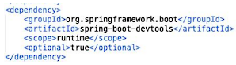
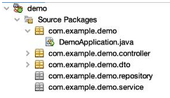
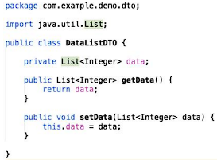
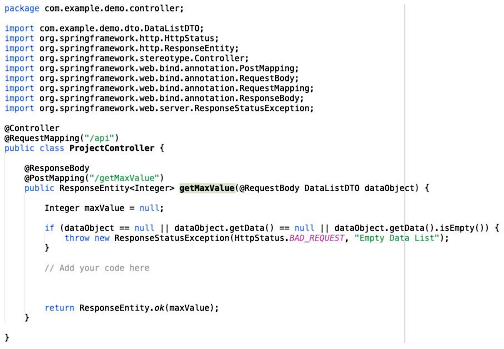
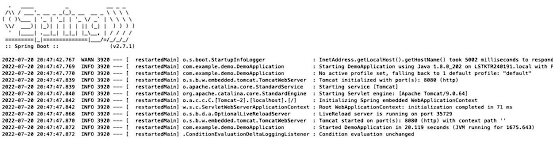
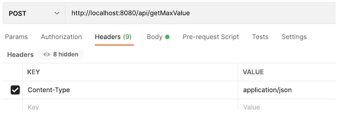
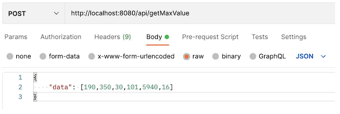

# Evaluación Práctica

## Tecnologías requeridas para aplicar esta evaluación

- Java 1.8
- Librería Spring Boot
- Librería Spring Web
- Maven
- SoapUI o Postman
- Angular 8+

## Herramientas requeridas para desarrollo:

- IDE Eclipse o Spring Tool Suite
- Opcional Visual Studio Code para el Front End

## Requerimientos del proyecto

Generar el Proyecto con Spring Initializr, desde https://start.spring.io/

1. Project: Maven Project
2. Languaje: Java
3. Spring Boot: Default
4. Group: Default
5. Artifact: Default
6. Name: Default
7. Description: Default
8. Package name: Default
9. Packaging: Jar
10. Java: 8
11. Dependencies:
- a) Spring Web
- b) Spring Boot DevTools

Clic en el Botón `Generate`

Descomprimir el zip

Abrir la carpeta desde Eclipse: File > Open Project

Abrir el pom.xml y dentro de las dependencias con el artifactId “spring-boot-devtools” y asignar el valor “true” dentro de <optional>

Comprobar que el proyecto compile: clic derecho sobre el proyecto y seleccionar “Clean and Build”.

En la carpeta Source Packages, se encuentra el paquete “com.example.demo” (Este nombre depende de lo que agregaste en el paso 8 dentro de Spring Initializr) 

crear los siguientes paquetes > New Java Package:

- Package Name: “com.example.demo.service” (Nota: no puedes modificar com.example.demo)
- Package Name: “com.example.demo.controller” (Nota: no puedes modificar com.example.demo)
- Package Name: “com.example.demo.repository” (Nota: no puedes modificar com.example.demo)
- Package Name: “com.example.demo.dto” (Nota: no puedes modificar com.example.demo)

Tu proyecto se debe ver algo asi:

Dentro de “com.example.demo.dto” crea una clase llamada DataListDTO.java

Agrega lo siguiente:

Dentro de "com.example.demo.controller" crea una clase llamada ProjectController.java

Agrega lo siguiente:

Agrega el código necesario para que el método retorne siempre el elemento más grande dentro de la lista. 

Una vez agregado el código, deberás ejecutar el Proyecto, esto levantará un servicio en Tomcat en la ruta http://localhost:8080

Por útimo, para hacer las pruebas necesarias dentro de Postman debes tener losiguiente:

Al terminar el ejercicio repasar todo el código escrito ya que se harán preguntas sobre el funcionamiento del mismo, así como de las notaciones de Spring utilizadas. 

Adicionalmente se aconseja crear un proyecto web sencillo en Angular 8 o superior (Opcionalmente puede ser React) en donde se consuma el servicio creado. 

Antes de presentar la entrevista deberás tener en ejecución los proyectos ya que para revisar el funcionamiento de los mismos deberás compartir tu pantalla.