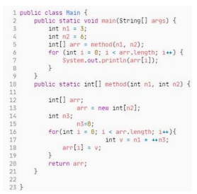
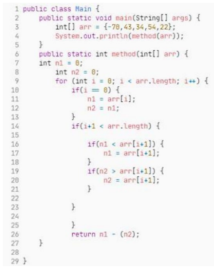
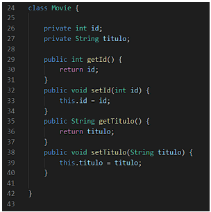
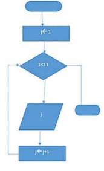
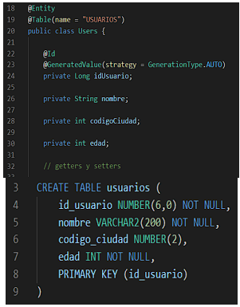
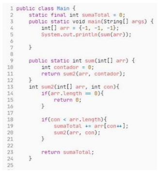
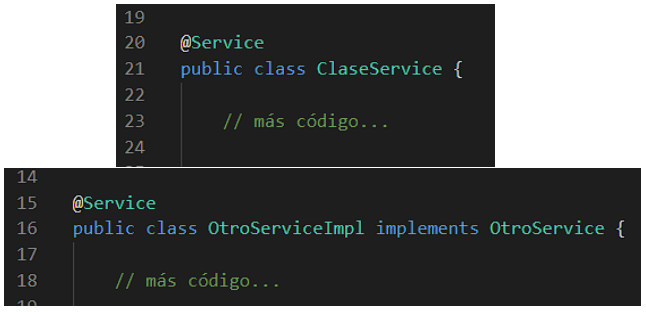

# Java Exam Guide Code Analysis

1. Lee el siguiente código y en caso de encontrar alguna mejora, describe cuál o cuáles serían. Si lo consideras necesario reescribe el código (o explícalo). 

2. ¿Cuál es la salida del siguiente código?

3. De las siguientes anotaciones cuáles son las mínimas que intervienen en la capa de persistencia

a. @Repository
b. @Service
c. @Controller
d. @Entity
e. @Override
f. @Table
g. @Column

4. Escriba una función para saber si el List<Movie> movieList contiene la Movie “m”, de ser necesario modifique el código de Movie:

5. ¿Cuál es la salida del siguiente diagrama de flujo?

6. Dado el siguiente código señale el error potencial

7. Identifica los errores en el siguiente fragmento de código

8. De las dos implementaciones mostradas a continuación responde las siguientes
preguntas:
a. ¿Alguna tiene error? de ser así ¿Cuál es el error?
b. ¿Ambas són válidas? de ser así ¿Por qué?
c. ¿Alguna tiene ventaja sobre la otra? de ser así ¿Cuál y porqué?

