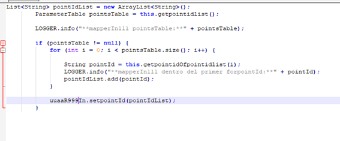
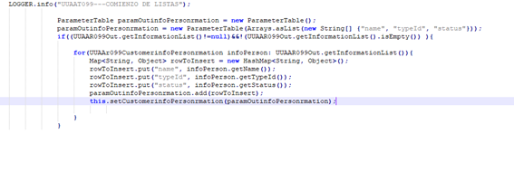

# Ejercicio JAVA

1. Explíqueme cómo funciona el tipo Map en java y póngame un ejemplo de uso.

2. Explíqueme cómo funciona el patrón Singleton en java.

3. Implemente la clase puntoImpl, de tal manera que pueda reutilizarse para diferentes casos, tenga en cuenta todos los métodos genéricos que suelen crearse para un tipo, como la representación por cadena(String) o el criterio de igualdad.

4. Créeme la clase puntoHijoImpl que herede de puntoImpl, siendo siempre puntoHijo un punto con los atributos x=1 e y=1

5. Busque el fallo o fallos y responda a la siguiente pregunta ¿Qué añadiría a la declaración para que se convirtiesen en constantes?

6. Escriba una expresión lógica que sea cierta si un número entero ‘num’ está comprendido entre 1 y 5 (ambos inclusive) o bien es igual a 9.

7. Explique la diferencia entre igualdad e identidad, ponga ejemplos.

8. Cree un método estático que calcule el máximo de tres números enteros dados.

9. Añada al método anterior una captura de excepción con IllegalArgumentException en el caso de que uno de los enteros sea mayor que 10.

10. ¿Explíqueme que es una variable estática y póngame el ejemplo de una?

11. Escriba el método public static SortedMap cuentaPalabras(String frase)

12. Dado el siguiente código, ¿podrías explicar con tus palabras cómo funciona el tipo “ParameterTable”?

