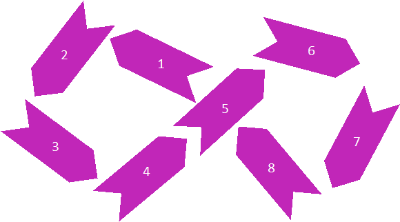
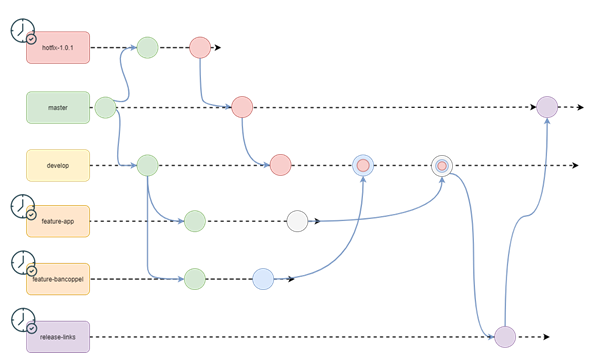

Evaluacion DevSecOps

1. ¿Qué procesos se automatizan con la implantación de DevSecOps?

2. ¿Cuáles son las principales tareas que debe ejecutar un flujo de integración continua?

3. ¿De quién es responsabilidad la generación de las pruebas unitarias?

4. ¿Cuánto tiempo debería durar un sprint (SCRUM)?

5. ¿De quién es responsabilidad la provisión de los ambientes de desarrollo y aseguramiento de la calidad?

6. ¿De quién es responsabilidad la provisión de los ambientes de pre producción y producción?

7. Coloca en el paréntesis el número en el lugar que corresponda (del 1 al 8) según el flujo DevSecOps.

    () Dev
    () Operate
    () CAMS
    () Monitor
    () Plan
    () Test
    () CD
    () CI
    () Code
    () Ops
    () Deploy
    () Build
    () Release
    () Sec

8. Describe cuáles son los principios CAMS y a qué se refiere cada uno.

    Sigla | Principio | Descripcion
    -     
    C     | Cultura   |   
    -
    A     |           |
    -
    M     |           |
    -
    S     |           |
    -

9. Describe a qué refiere cada uno de los flujos de automatización y qué herramienta(s) se pueden utilizar para generarlos.

    Siglas | Nombre | Descripcion | Herramientas
    -
    CI     | Continuous Integration |           |
    -
    CD     |        |           |
    -
    CD     |        |           |
    -
    CT     |        |           |
    -
    CM     |        |           |
    -
    IaC    |        |           |
    -

10. Cuales son los principales pasos que debe hacer cada uno de los siguientes flujos, cuál es su entrada y su resultado esperado. 

    Fase | Entrada/Trigger | Pasos de su ejecución | Salida/Resultado esperado
    -
    CI   |                 |                       |
    -
    CD   |                 |                       |
    -

11. Describe la funcionalidad de los siguientes comandos GIT.

    Comando | Descripcion
    -
    git commit –m “xxx” | 
    -
    git checkout –b featureX |
    -
    git remote -v |
    -
    git switch master |
    -
    git push -u origin featureX |
    -
    git add . |
    -
    git remote add origin … |
    -
    git fetch |
    -
    git pull |
    -
    git status |
    -

12. Describe tu interpretación del siguiente diagrama de estrategia de branching

    - ...