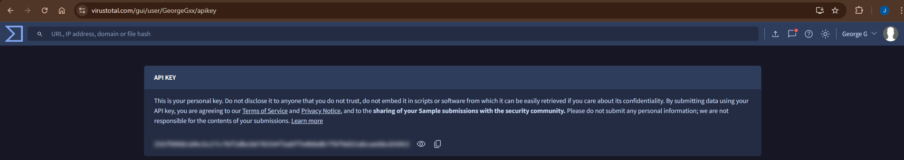

# 🧠 Malware Scanner API (with Health Check)

FastAPI-based REST API to upload files and scan them using **VirusTotal API**, containerized with **Docker + Compose**.

---

## 🚀 Run with Docker Compose

### 1️⃣ Build & Run
```bash
docker compose up --build -d
```

### 2️⃣ Health Check Endpoint
```bash
curl http://localhost:8000/health
```
Response:
```json
{"status": "ok", "service": "Malware Scanner API"}
```

### 3️⃣ Test the Scanner API
```bash
curl -X POST "http://localhost:8000/scan" -F "file=@/path/to/file"
```
Swagger UI available at:  
👉 http://localhost:8000/docs

---

## ⚙️ Environment Variables
| Variable | Description |
|-----------|--------------|
| `VT_API_KEY` | Your VirusTotal API key |



---

## 🧰 Tech Stack
- FastAPI
- Uvicorn
- Docker
- Docker Compose
- VirusTotal API

---

## 🔒 Security & Validation
- `/health` endpoint for status monitoring
- Supported file types: .exe, .pdf, .zip, .docx, .xlsx, .txt
- Max upload size: 10 MB
- No files stored on disk
- API key from environment

---

👤 Author: Jorge Gallaga
